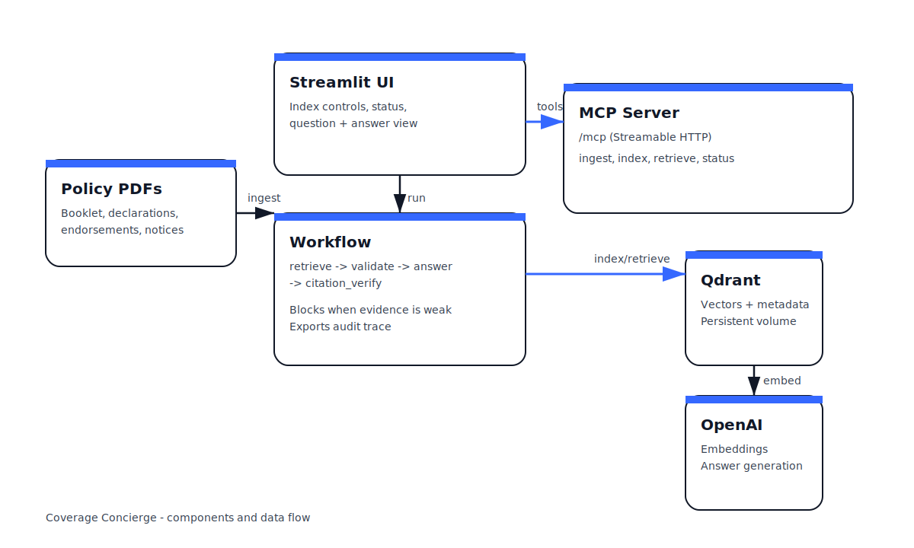

# Coverage Concierge - Proposal (Policy-Grounded Coverage Assistant)

## 1) Problem statement
Homeowners insurance policy packets are long and fragmented (booklet, declarations, endorsements, change notices). Service and claims teams repeatedly answer the same coverage questions while manually searching PDFs, reconciling endorsements, and explaining conditions and exclusions. This increases handle time, produces inconsistent guidance, and raises the risk of incorrect answers when evidence is missing.

## 2) Proposed solution (tool-driven workflow)
Coverage Concierge is built for insurance teams who need accurate, explainable answers from policy content. It retrieves evidence, applies an explicit decision path, declines low-confidence questions, verifies citations, and produces defensible outputs grounded in the policy packet.

## 3) Workflow (end-to-end)
1. Ingest policy PDFs locally (extract text; summarize files/pages).
2. Index policy text into Qdrant (chunk -> embed -> upsert).
3. Ask a coverage question.
4. Retrieve top matching clauses/snippets via MCP tool.
5. Validate evidence quality (block early if weak or inconsistent).
6. Generate an answer with citations.
7. Verify citations against retrieved snippets; retry once if needed.
8. Present answer + sources + audit trace; optionally create a handoff ticket.

## 4) Technical architecture
- UI: Streamlit
- Workflow engine: LangGraph state machine
- Tool layer: MCP server (Streamable HTTP) exposing ingest/index/retrieve/status tools
- Vector store: Qdrant (Docker, persistent volume)
- Text and embedding service: OpenAI (embeddings + response generation)

Reference: ARCHITECTURE.md

Architecture diagram:



## 5) MCP tools (what they do)
- `health`: confirms tool server availability.
- `index_status`: reports Qdrant reachability, collection presence, and embedding-provider configuration.
- `ingest_folder`: extracts text and returns summaries/stats.
- `index_folder_qdrant`: chunks text, generates embeddings, and writes to Qdrant.
- `retrieve_clauses`: retrieves relevant snippets with metadata and scores.
- `start_ingest_job` / `start_index_job` + `job_status`: progress reporting for long-running operations.
- `create_handoff_ticket` / `list_handoff_tickets`: structured payload for human review (redacted previews).

## 6) Testing (MCP Inspector / Postman)

You can validate the tool server independently of the UI.

MCP Inspector:
- Start the MCP server.
- In MCP Inspector, connect to the server at `http://127.0.0.1:4200/mcp/`.
- Run `health` first, then `index_status`, then a small `retrieve_clauses` call.

Postman:
- If you only need a quick connectivity check, test reachability on the same host/port.
- For tool calls, MCP Inspector or the included smoke script is the most reliable option.

Smoke script (recommended):

```bash
cd home-insurance-mcp-client
python scripts/client_smoke.py
```

Quick curl check (reachability only; tool calls are not plain GET):

```bash
curl -i http://127.0.0.1:4200/mcp/
```

## 6.1) Submission artifacts (DOCX/PDF)

This repo includes an exporter that produces document-format outputs into `dist/`.

- Git Bash: `bash scripts/export_submission.sh`
- PowerShell: `powershell -ExecutionPolicy Bypass -File scripts/export_submission.ps1`

Expected outputs:
- `dist/Coverage_Concierge_Proposal.docx` and `dist/Coverage_Concierge_Proposal.pdf`
- `dist/Coverage_Concierge_Project_Brief.docx` and `dist/Coverage_Concierge_Project_Brief.pdf`
- `dist/Coverage_Concierge_90_Second_Pitch.docx` and `dist/Coverage_Concierge_90_Second_Pitch.pdf`

If `pandoc` is installed, export quality is higher. If not, the scripts fall back to a dependency-free exporter that still produces valid DOCX and a simple text-only PDF (HTML is also generated for browser print-to-PDF).

## 7) Expected impact (quantified, with assumptions)
Pilot assumptions:
- Common coverage questions handled by a service team.
- Policy packet is already available and indexed for the relevant product/customer.
- The workflow is used for first-pass guidance with citations; humans retain final decision authority.

Target outcomes (example ranges):
- Reduce policy clause lookup time from 12 minutes to 7 minutes (~42% reduction).
- Improve first-contact resolution by 10-15% for common coverage questions.
- Reduce escalations by 5-10% by providing cited evidence and clear "what to verify" guidance.

### Category alignment
This use case aligns to **Insurance** (customer service and claims support). It focuses on evidence-backed answers, endorsement awareness, and auditability so responses are faster and defensible.

## 8) Safety and guardrails
- Local-first documents: PDFs remain under `docs/` (ignored by git).
- Privacy guardrails: UI warns against pasting PII; audit previews redact common patterns.
- Evidence gating: blocks answers when retrieval is too weak to support a safe response.
- Citation verification: checks citations against retrieved snippets; invalid citations trigger a rewrite or block.
- Endorsement override awareness: when endorsements are retrieved, the workflow flags override risk.

## 9) Success metrics (production)
- Median handle time for coverage questions.
- First-contact resolution rate for top question categories.
- Escalation/reopen rate.
- Blocked-run rate and top reasons (used to improve document completeness/indexing).
- Audit trace usage and handoff ticket usage (as proxies for explainability/compliance utility).

## 10) Why this approach

This application prioritizes reliability and reviewability:

- Evidence-first workflow with explicit blocking when sources are weak.
- Citation verification against retrieved snippets (reduces confident-but-unsupported output).
- Job-based ingest and indexing with progress reporting (predictable demos on Windows).
- Local-first documents and a structured audit trace for follow-up and handoff.
